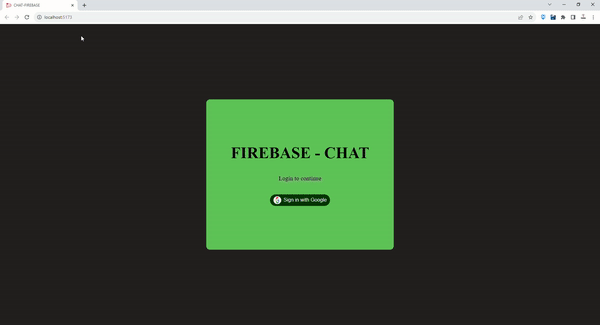

# Dubai Chat - Real-time Chat Application

Dubai Chat is a real-time chat application designed for residents of Dubai. This application allows users to communicate with each other, join different chat rooms, and share messages instantly. It's built using Firebase for real-time data synchronization and authentication.

## Screen

## Features

- **Real-time Messaging**: Engage in real-time conversations with other users.
- **Multiple Chat Rooms**: Join different chat rooms to discuss various topics.
- **User Authentication**: Securely log in with Google authentication.
- **Responsive Design**: Enjoy a seamless chat experience on various screen sizes.

## Technologies Used

- React: A popular JavaScript library for building user interfaces.
- Firebase: A cloud-based platform for building web and mobile applications.
- Firebase Authentication: For user login and authentication.
- Firebase Firestore: For real-time data storage and synchronization.
- HTML and CSS: For structuring and styling the application.

## Usage

* Visit the application in your browser.
* Log in with your Google account.
* Choose a chat room or create a new one.
* Start chatting with other users in real-time.

## Customization
Feel free to customize and extend this application to meet your specific needs. Some ideas for further development include:

* Adding private messaging functionality.
* Implementing user profiles with avatars.
* Enhancing the user interface with more features.